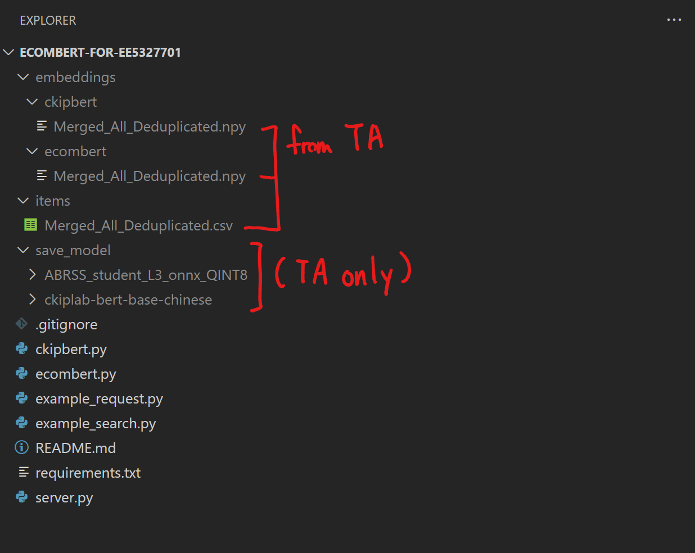

# Semantic Searching System for NTUST Big Data Analysis Course (EE5327701)

This repository contains a system that generates embeddings for e-commerce product descriptions using both the distilled and quantized **Semantic model** model and the **CKIP BERT** model. It is designed as a demonstration project for the **NTUST Big Data Analysis course (EE5327701)**.

*Special thanks to William Wu (clw8998), who created the distillation and quantization model for this project. It's truly outstanding work!*

## Features

- **Dual Model Support:** Provides options to use either the Semantic model or the CKIP BERT model for generating embeddings.
- **Efficient Embedding Generation:** Utilizes a distilled and quantized version of Semantic model and the optimized CKIP BERT for fast inference and reduced model size.
- **Batch Processing:** Handles multiple input sentences in batches, leveraging ONNX quantization for performance.
- **API Integration:** Offers a RESTful API endpoint for generating embeddings using Flask (handled by the TA).
- **Multilingual Support:** Capable of handling English and Chinese product descriptions.

## Roles and Responsibilities

### Students

- **Usage:** Students are only responsible for sending requests to the API and do **not** need to host the model API server locally.
- **Focus:** The focus for students is to work on tasks such as retrieving embeddings for product descriptions and performing further analysis or tasks based on the embeddings provided by the API.
- **Pre-computed Embeddings:** Students can use the pre-computed embeddings provided by the TA for both Semantic model and CKIP BERT models.
- **No Need for Model Files:** Students do not need to download or manage the model files, as the server is hosted by the TA.

### TAs

- **Hosting the API Server:** TAs are responsible for hosting and maintaining the model API server that the students will interact with.
- **Model Management:** TAs will ensure that the pre-trained Semantic model and CKIP BERT models are available on the server and correctly set up for inference.
- **Providing Pre-computed Embeddings:** TAs will supply the pre-computed embeddings for both models to the students.

## Table of Contents

- [Installation (For TAs Only)](#installation-for-tas-only)
- [Installation (For Students)](#installation-for-students)
- [Usage](#usage)
  - [Using `example_request.py`](#using-example_requestpy)
  - [Using `example_search.py`](#using-example_searchpy)
- [API Documentation](#api-documentation)
  - [Endpoint](#endpoint)
  - [Request Format](#request-format)
  - [Response Format](#response-format)
  - [Example Usage](#example-usage)
- [Notes](#notes)

## Installation (For Students)

Please ensure that the received embeddings from the TA are placed in the following directories based on the model:

- **For Semantic model embeddings:** Place the `.npy` files in the `./embeddings/semantic_model/` directory.
- **For CKIP BERT embeddings:** Place the `.npy` files in the `./embeddings/ckipbert/` directory.

Make sure that the corresponding product CSV files are located in the `./items/` directory. Each CSV file should have a `product_name` column, and the `.npy` embeddings should have **the same filename** (excluding the extension) as the CSV files they correspond to. For example:

```
./items/example_filename.csv
./embeddings/semantic_model/example_filename.npy
./embeddings/ckipbert/example_filename.npy
``` 

This ensures that the search and analysis scripts can properly load the embeddings for the correct products.

## Repository Structure

After correctly placing the embeddings and CSV files, your repository structure should look like this:



The `./items/Merged_All_Deduplicated.csv` file is an example of a product CSV file and the `./embeddings/` directory contains the pre-computed embeddings for the products.

Note that the `./save_model/` directory is not required for students, as the models are hosted by the TA.

## Usage

The main task for students is to retrieve embeddings by interacting with the API server and using the provided pre-computed embeddings for analysis. Below are examples of how students can utilize the system:

### Using `example_request.py`

This script demonstrates how to send a POST request to the API and process the response.

```bash
python example_request.py
```

### Using `example_search.py`

This script demonstrates how to perform a semantic search using the pre-computed embeddings provided by the TA.

```bash
# For Semantic model
python example_search.py --model_type semantic_model

# For CKIP BERT
python example_search.py --model_type ckipbert
```

**Contents of `example_search.py`:**

- **Example Usage:**

  Run the script and enter a query when prompted:

  ```bash
  Enter query: YOGiSSO 魚造型貓薄荷玩偶, 黑色, 1入
  ```

  The script will output the top-k similar products:

  ```
  Takes 0.1234 seconds to search
  [Rank 1 (0.95)] YOGiSSO 魚造型貓薄荷玩偶, 黑色, 1入
  [Rank 2 (0.85)] Other similar product name
  ...
  ```

- **Note:**

  Ensure that you have access to the pre-computed embeddings provided by the TA before running this script.

## API Documentation

### Endpoint

- **URL:** `http://<TA-server-address>:5000/api/embed`
- **Method:** `POST`
- **Content-Type:** `application/json`

### Request Format

- **Body:**

  ```json
  {
    "text": [
      "Product description 1",
      "Product description 2",
      "..."
    ]
  }
  ```

- **Parameters:**

  - `text`: A list of product descriptions (strings) you want to generate embeddings for.

### Response Format

- **Body:**

  ```json
  [
    [0.1, 0.2, 0.3, ..., 0.128],
    [0.5, 0.6, 0.7, ..., 0.256],
    ...
  ]
  ```

- **Details:**

  - Returns a list of embeddings corresponding to each input text.
  - Each embedding is a list of floating-point numbers (vector).

### Example Usage
Using `curl` for Quick Testing:

```bash
curl -X POST -H "Content-Type: application/json" -d '{"text": ["Product description 1", "Product description 2"]}' http://<TA-server-address>:5000/api/embed
```

## Notes

- **For Students:**

  - You are **not required** to download the models or set up the API server.
  - Focus on utilizing the embeddings provided by the API and the pre-computed embeddings for your analysis.
  - Ensure that your requests comply with the API specifications.

- **For TAs:**

  - Make sure the API server is up and running throughout the lab sessions.
  - Ensure both models (Semantic model and CKIP BERT) are loaded properly if providing both options.
  - Provide the pre-computed embeddings to the students.
  - Monitor server performance and handle any issues that arise.


---

This repository is created for academic purposes as part of the NTUST Big Data Analysis course (EE5327701). Feel free to modify and extend it for other projects!